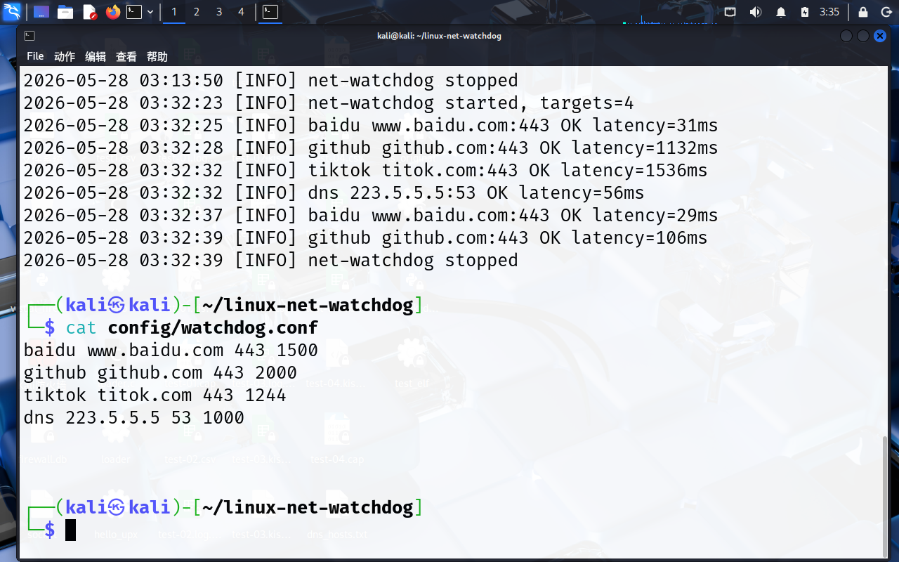
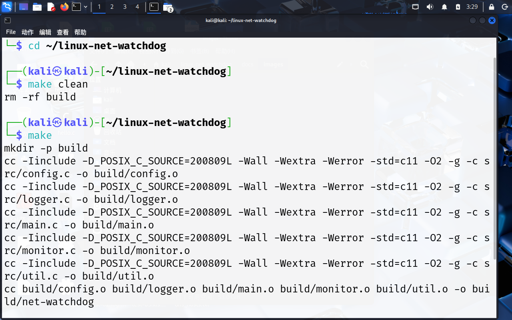
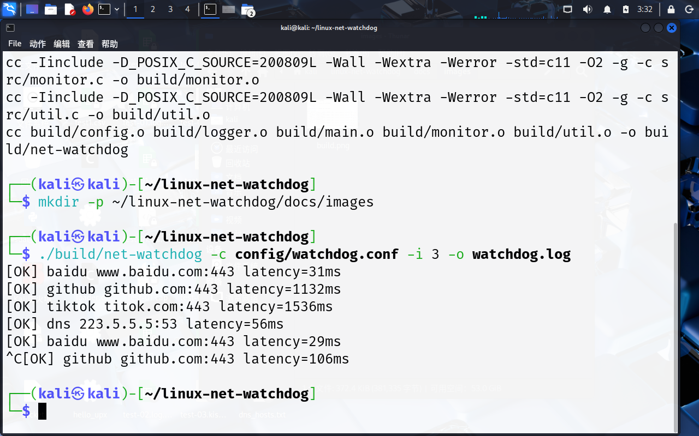
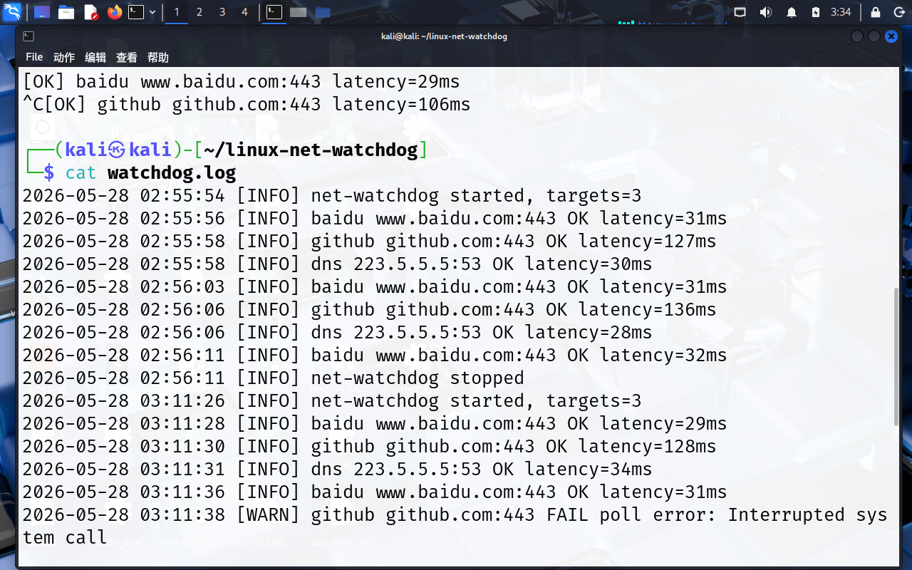

# Linux Net Watchdog

基于 C 语言和 Linux Socket 的网络设备状态监控工具，面向嵌入式 Linux、网关设备、边缘设备和实验环境中的网络连通性检测场景。

项目通过配置文件管理检测目标，周期性检测指定 IP 或域名的 TCP 端口可达性，并将检测结果、连接延迟和失败原因记录到日志文件中。项目结构较小，适合作为 Linux 网络编程、Socket 编程、Makefile 构建和嵌入式 Linux 应用层开发的练习项目。

## 项目背景

在嵌入式设备、网关设备或 Linux 边缘节点中，经常需要判断设备是否能够访问网关、DNS、云端服务或本地业务端口。传统的 `ping` 只能验证 ICMP 层面的连通性，但很多服务器会关闭 ICMP，且 ICMP 通并不代表业务端口可用。

本项目使用 TCP 端口探测的方式，更贴近实际业务服务状态。例如检测 `80`、`443`、`22`、`53` 等端口是否可以建立连接，从而辅助判断网络链路、服务状态或设备通信异常。

## 功能特点

- 支持通过配置文件管理多个检测目标。
- 支持 IP 地址和域名形式的检测目标。
- 支持 TCP 端口连通性检测。
- 支持自定义检测超时时间。
- 支持自定义检测间隔。
- 支持将检测结果写入日志文件。
- 支持记录成功、失败、延迟和错误原因。
- 支持 `SIGINT`、`SIGTERM` 信号退出，方便终端停止程序。
- 使用 Makefile 管理构建流程，无第三方运行依赖。
- 项目按配置解析、日志模块、监控模块、工具函数进行拆分，便于阅读和扩展。

## 技术栈

- C
- Linux
- POSIX Socket
- Non-blocking connect
- poll
- Makefile
- TCP/IP
- 文件日志
- 配置文件解析

## 目录结构

```text
linux-net-watchdog/
├── Makefile
├── README.md
├── config/
│   └── watchdog.conf
├── docs/
│   └── images/
│       ├── build.png
│       ├── running.png
│       ├── log.png
│       └── config.png
├── include/
│   ├── config.h
│   ├── logger.h
│   ├── monitor.h
│   └── util.h
└── src/
    ├── config.c
    ├── logger.c
    ├── main.c
    ├── monitor.c
    └── util.c
```

## 编译运行

### 1. 安装编译环境

在 Kali Linux、Ubuntu 或其他 Debian 系 Linux 环境中执行：

```bash
sudo apt update
sudo apt install -y build-essential git
```

### 2. 克隆项目

```bash
git clone https://github.com/yuyuan-cmyk/linux-net-watchdog.git
cd linux-net-watchdog
```

### 3. 编译项目

```bash
make
```

编译成功后会生成可执行文件：

```text
build/net-watchdog
```

### 4. 运行程序

```bash
./build/net-watchdog -c config/watchdog.conf -i 3 -o watchdog.log
```

参数说明：

| 参数 | 说明 |
| --- | --- |
| `-c` | 指定配置文件路径 |
| `-i` | 指定检测间隔，单位为秒 |
| `-o` | 指定日志输出文件 |

停止程序：

```text
Ctrl + C
```

### 5. 查看日志

```bash
cat watchdog.log
```

## 配置文件说明

配置文件路径：

```text
config/watchdog.conf
```

每一行表示一个检测目标，格式如下：

```text
名称 主机 端口 超时时间(ms)
```

示例：

```text
baidu www.baidu.com 443 1500
github github.com 443 2000
dns 223.5.5.5 53 1000
```

字段说明：

| 字段 | 含义 |
| --- | --- |
| 名称 | 用于日志和终端输出的目标名称 |
| 主机 | IP 地址或域名 |
| 端口 | 需要检测的 TCP 端口 |
| 超时时间 | 单次连接等待时间，单位为毫秒 |

以 `#` 开头的行会被程序忽略，可用于写注释。

## 运行截图

### 配置文件



### 编译成功



### 程序运行



### 日志输出



## 核心实现思路

项目的核心检测逻辑位于 `src/monitor.c`。

程序会先通过 `getaddrinfo` 将配置中的域名或 IP 解析为可连接地址，然后创建 TCP Socket。为了避免连接长时间阻塞，项目将 Socket 设置为非阻塞模式，并调用 `connect` 发起连接。

如果连接处于进行中状态，程序会使用 `poll` 等待 Socket 可写，并根据配置文件中的超时时间控制等待时长。最后通过 `getsockopt` 读取 `SO_ERROR` 判断连接是否真正成功。

检测完成后，程序会记录以下信息：

- 检测目标名称
- 目标 IP 或域名
- 目标端口
- 检测是否成功
- 连接延迟
- 失败原因
- 检测时间

## 模块说明

| 文件 | 说明 |
| --- | --- |
| `src/main.c` | 程序入口，负责参数解析、主循环和信号处理 |
| `src/config.c` | 配置文件解析，加载检测目标 |
| `src/monitor.c` | TCP 端口探测核心逻辑 |
| `src/logger.c` | 日志文件写入 |
| `src/util.c` | 时间、字符串处理和辅助函数 |
| `include/*.h` | 项目头文件 |

## 测试场景

项目可用于验证以下场景：

- 正常网站 HTTPS 端口可达。
- DNS 服务器端口可达。
- 目标主机不可达。
- 目标端口关闭。
- 网络连接超时。
- 程序运行中断后正常退出。
- 日志文件是否持续记录检测结果。

可以在配置文件中加入一个不可达目标，用于观察失败日志：

```text
badhost 192.0.2.1 12345 1000
```

## 项目收获

通过该项目，主要练习了以下内容：

- Linux 下 C 程序的基本工程组织方式。
- Makefile 构建流程。
- POSIX Socket 编程。
- 非阻塞连接和超时控制。
- TCP 端口连通性检测。
- 配置文件解析。
- 日志模块设计。
- Linux 程序的信号退出处理。
- 网络异常场景的定位思路。

## 后续可扩展方向

- 增加 ICMP 检测能力。
- 增加网卡状态读取，例如读取 `/sys/class/net`。
- 增加 JSON 或 INI 配置格式。
- 增加守护进程模式。
- 增加异常次数统计和告警输出。
- 增加定时生成检测报告功能。
- 移植到 ARM Linux 开发板上运行。

## 适用方向

该项目适合作为以下方向的学习和实践项目：

- 嵌入式 Linux 应用开发
- Linux 网络编程
- C 语言项目实践
- 网络通信与故障诊断
- 网关设备状态检测
- 边缘设备网络监控

## 说明

本项目是一个用于学习 Linux 网络编程和嵌入式 Linux 应用开发的练习项目，重点在于理解 TCP 连接检测、日志记录、配置解析和 Linux C 工程组织方式，不用于替代专业监控系统。
